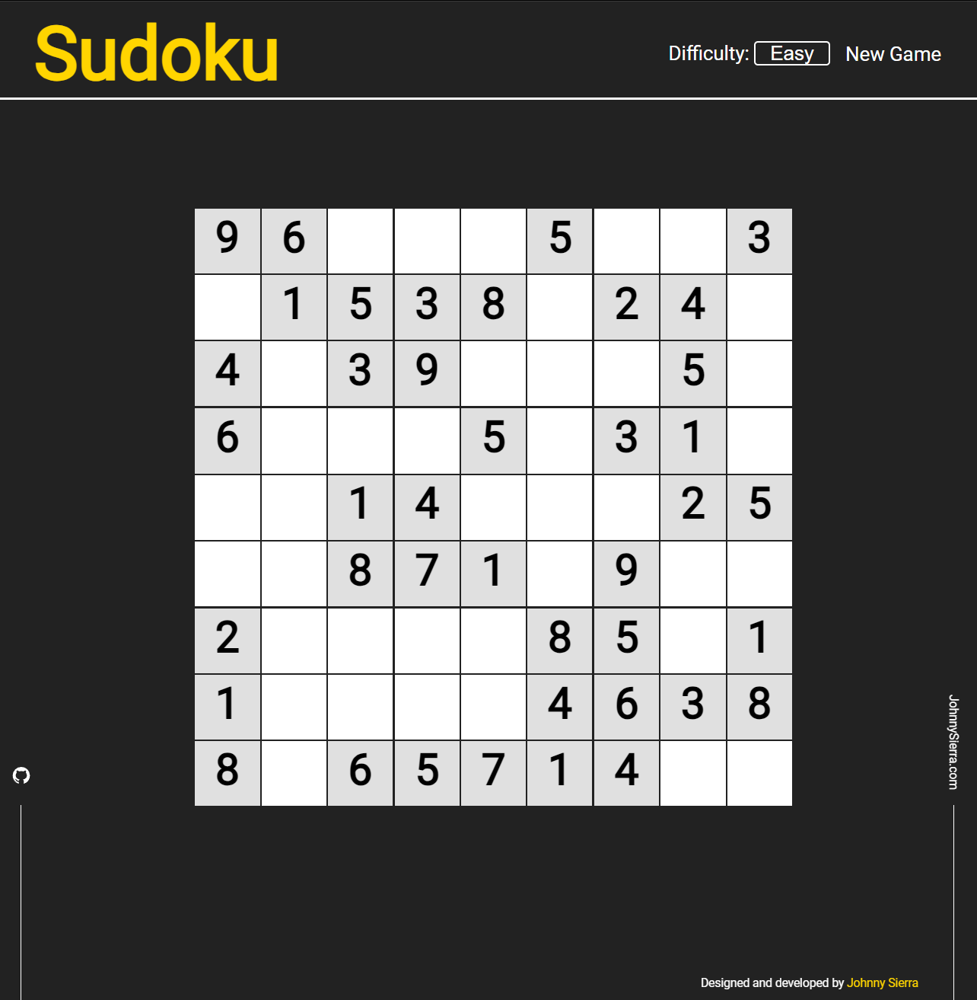
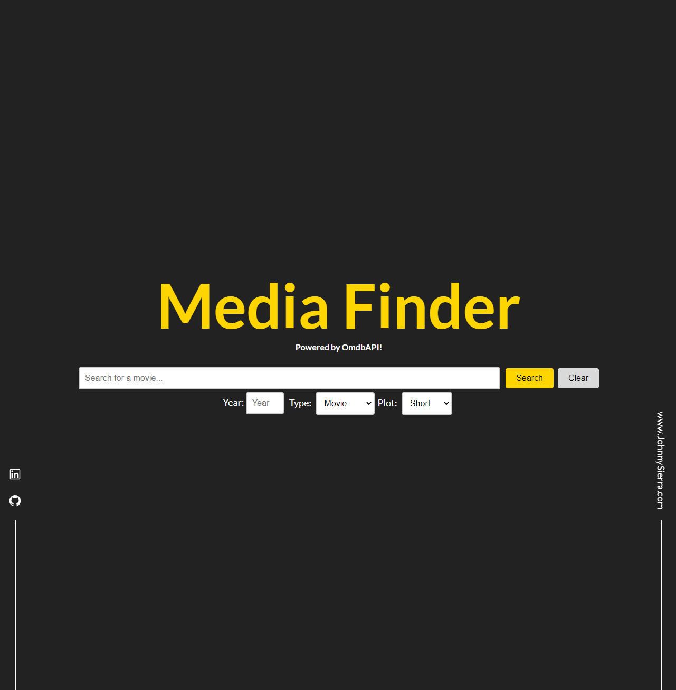

# Johnny Sierra - Web Developer Portfolio

Welcome to my web development portfolio! This repository showcases my skills and experiences through real-world examples of my work.

## Table of Contents

- [About Me](#about-me)
- [Work](#work)
- [Contact](#contact)

## About Me

I am a passionate web developer with a strong foundation in computer science. Here's a brief overview of my academic and professional journey:

- **Bachelor of Science in Computer Science**
    - *University of Houston*
    - *February 2011 - March 2016*

## Work

- **React Developer at R & R Fleet Tech**
    - *August 2016 - July 2019*
    - Developed a groundbreaking program streamlining operations for a Houston-based fleet service.

- **Web Operations Specialist at Nuro**
    - *September 2019 - May 2023*
    - Played a key role in utilizing and refining cutting-edge web-based monitoring tools for autonomous vehicles.
  
### Projects

1. [Sudoku Puzzle](https://github.com/J-Sierra/React_Sudoku_Puzzle)
    - This project showcases my adeptness in web development, emphasizing intuitive UI and seamless state management for an engaging puzzle-solving journey.
    - [Demo Link](https://j-sierra.github.io/React_Sudoku_Puzzle/)

   

2. [Media Finder](https://github.com/J-Sierra/movie-search)
    - Using React and OmdbAPI, my movie search project delivers a swift and straightforward one-page search experience, providing detailed information about a movie instantly.
    - [Demo Link](https://j-sierra.github.io/movie-search/)

   

### Technologies Used

- HTML 5
- CSS 3
- JavaScript
- TypeScript
- React JS
- Redux Toolkit
- Tailwind CSS
- Node JS
- MongoDB
- Three JS
- Git
- Firebase
- Java
- Express.js

## Contact

Connect with me through the following channels:

- [LinkedIn](https://www.linkedin.com/in/johnny-sierra/)
- [GitHub](https://github.com/J-Sierra)
- [Resume](https://drive.google.com/file/d/1F3cE6J27PD5ZBQfXDjaeuy6hf3FhIISD/view?usp=sharing)

---

Feel free to explore my projects and reach out for collaboration or inquiries!
